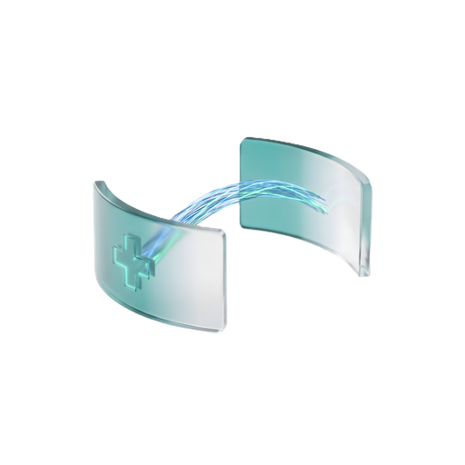

# DicomBridge — фоновый шлюз DICOM → PACS



> **Скачать установщик:** [DicomBridge-Setup.exe (последний релиз)](https://github.com/dosik74/DicomBridge/releases/latest/download/DicomBridge-Setup.exe) —
> мастер на русском спросит, куда установить, создаст ярлыки и предложит автозапуск.

Бесплатное Windows-приложение без лицензий и телеметрии: следит за локальной папкой,
при появлении нового DICOM-файла копирует его в рабочую папку экспорта, исправляет
метаданные (кодировка кириллицы, теги, UID, Patient ID, транслитерация, анонимизация)
и отправляет на PACS по DICOM-сети (C-STORE). Оригинал никогда не изменяется.

Название приложения меняется в одном месте — `APP_NAME` в `config.py`.

## Что нового

### v1.0.2
- Фирменный логотип везде: иконка окна и трея, диалог «О программе»,
  мастер установщика, иконка .exe и установщика.

### v1.0.1
- Установщик с мастером на русском языке: спрашивает, куда установить,
  создаёт ярлыки в меню «Пуск» и на рабочем столе, опция автозапуска с Windows,
  страница лицензии, кнопка запуска после установки.
- Кнопка «GitHub автора» в диалоге «О программе».
- Несколько независимых копий на одном ПК (`--config`), имя профиля в заголовке.
- Игнор временных файлов по расширениям и фрагментам имён.
- Украинская транслитерация (КМУ 55).
- Дисклеймер при первом старте, контакты обслуживания, пакет диагностики для поддержки.

### v1.0.0
- Первый публичный релиз: мониторинг папки, исправление кодировки cp1251,
  правила тегов, Patient ID, UID, транслитерация, анонимизация,
  отправка C-STORE / проверка C-ECHO, очередь ошибок, статистика, лог, трей.

## Структура

```
main.py                 точка входа (один экземпляр, трей, автозапуск мониторинга)
config.py               APP_NAME + ConfigManager (config.ini)
i18n.py                 строки интерфейса (русский, для локализации)
core/
  watcher.py            мониторинг папки (watchdog), стабильность файла, UNC-предупреждение,
                        игнор по расширениям/именам, запрет пересечения папок
  processor.py          конвейер обработки (воркер-поток, очередь задач)
  encoding_fix.py       перекодировка cp1251 → ISO_IR 144 / ISO_IR 192 + анализ файла
  tags.py               правила редактирования тегов + JSON импорт/экспорт
  uid.py                проверка/генерация UID + детерминированный Patient ID
  anonymizer.py         анонимизация
  transliteration.py    ГОСТ 7.79 / упрощённая / украинская (КМУ 55)
  sender.py             C-STORE / C-ECHO (pynetdicom)
  queue.py              персистентная очередь ошибок (SQLite)
  cleanup.py            автоочистка экспорта и логов
  logging_setup.py      logging с ротацией + мост в окно лога
  support_bundle.py     zip-пакет диагностики для инженера поддержки
gui/
  main_window.py        главное окно: Главная/Настройки/Правила/Очередь/Лог + трей,
                        дисклеймер, «О программе», кнопки очистки папок
LICENSE.txt             отказ от ответственности (as is, не медицинское изделие)
```

## Несколько копий на одном ПК (несколько отделений/модальностей)

Как в оригинале: один экземпляр следит за одной папкой импорта.
Масштабирование — отдельными копиями с разными конфигами:

```bat
python main.py --config D:\hosp1\config.ini --minimized
python main.py --config D:\hosp2\config.ini --minimized
```

У каждой копии свой мьютекс (по хешу пути конфига), свои папки,
своя очередь и имя профиля в заголовке окна. Папки импорта/экспорта/лов
разных копий не должны пересекаться (проверяется при сохранении настроек).

Дополнительно из мануала оригинала:
- отдельная настраиваемая папка логов;
- игнор временных файлов: по расширениям (`.tmp .log …`) и по фрагментам
  имён (регистр не важен) — для аппаратов вроде Titan 2000 / ИнтегРИС;
- очистка при каждом запуске + кнопки «Очистить папку экспорта/логов»;
- украинская транслитерация (КМУ 55) на выбор.

## Поддержка нескольких больниц

- Вкладка «Настройки» → блок «Обслуживание»: организация, инженер, телефон —
  видны в «О программе» на каждом объекте.
- Вкладка «Лог» → «Пакет для поддержки…»: собирает zip с config.ini,
  rules.json, логами, дампом очереди и версиями — персонал присылает
  инженеру вместо выезда.
- При первом старте показывается дисклеймер (as is, не медицинское изделие,
  ответственность внедряющей организации) — текст также в `LICENSE.txt`.

## Установка и запуск (Windows, Python 3.11+)

```bat
cd "exportMed MUSE"
python -m venv .venv
.venv\Scripts\activate
pip install -r requirements.txt
python main.py
```

## Тесты

```bat
python -m pytest tests -q
python tools\make_test_dicoms.py --out test_dicoms --count 3
```

## Проверка с локальным тестовым PACS

Вариант A — Orthanc (проще всего через Docker):

```bat
docker run -p 4242:4242 -p 8042:8042 jodogne/orthanc-plugins
```

Затем в настройках DicomBridge: host=127.0.0.1, port=4242, remote AE Title=ORTHANC,
локальный AE Title=DicomBridge (пропишите его в Orthanc как разрешённый modality),
кнопка «Проверить соединение» → C-ECHO успешен. Файлы из `test_dicoms` кидайте в
папку импорта.

Вариант B — тестовый SCP из pynetdicom (без Docker, pynetdicom 3.x):

```bat
python -m pynetdicom.apps.storescp.storescp 11112 --ae-title PACS --output-dir incoming_test
```

Настройки: host=127.0.0.1, port=11112, remote AE Title=PACS.
Проверка из командной строки:

```bat
python -c "from core.sender import PacsSender; print(PacsSender(remote_aet='PACS', host='127.0.0.1', port=11112).test_echo())"
```

## Сборка .exe

```bat
build.bat
```

Результат: `dist\DicomBridge.exe` (один файл, без консоли). В `build.bat` уже
прописаны нужные `--hidden-import` и `--collect-all` для `pynetdicom`, `pydicom`,
`PySide6`, `watchdog`.

Типичные проблемы при сборке:
- антивирус блокирует свежесобранный exe → добавить папку в исключения;
- `ModuleNotFoundError: pynetdicom` в exe → проверить `--hidden-import`/`--collect-all`;
- пустое окно/краш на Win7 → поддерживается только Windows 10/11, Python 3.11+;
- нет иконки трея без GUI-сессии (RDP/Service) → запускать в пользовательской сессии;
- `storescp` отвечает Association Rejected → сверить AE Title и порт;
- длинные пути (>260 символов) → включить LongPaths в Windows или держать папки ближе к корню.
